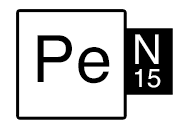

Pe-N15
=====

Encoding scheme for converting text to... a different output.

For each byte convert the 0-255 value to 8=D~, where the value is 8x(count ='s) + count(~)'s

[Online demo here](http://apitim.com/penis.php)

## Converting

### byte -> Pe-N15:

    equals = floor(byte/8)
    tildes = byte % 8

### Pe-N15 -> bytes:

    byte = 8*equals + tildes

## Example

Encode `hello`

    h = 8=============D
    e = 8============D~~~~~
    l = 8=============D~~~~
    l = 8=============D~~~~
    o = 8=============D~~~~~~~
    
Final output is one continuous stream, that is, `8=============D8============D~~~~~8=============D~~~~8=============D~~~~8=============D~~~~~~~`
